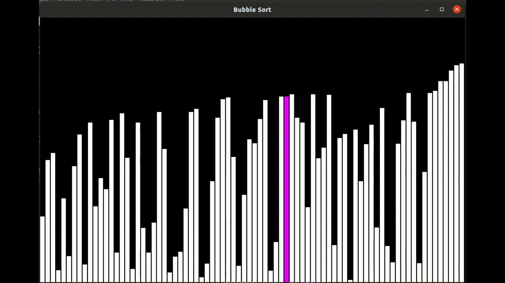
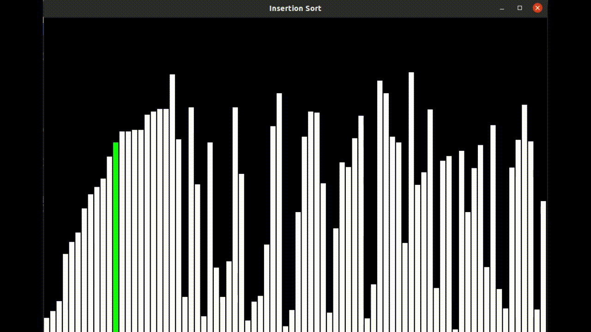
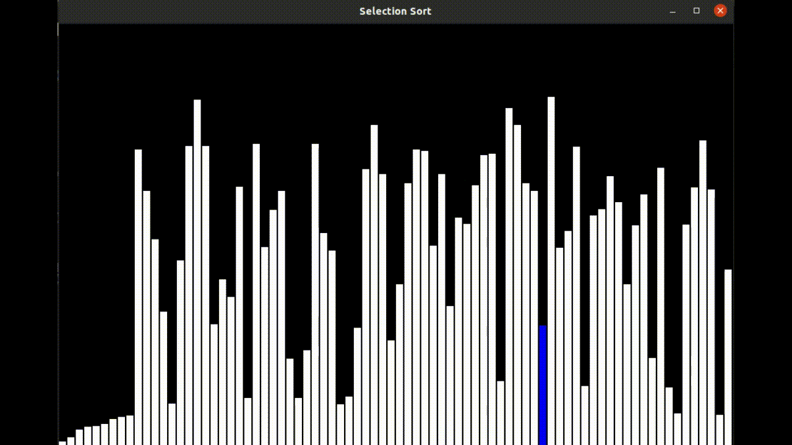
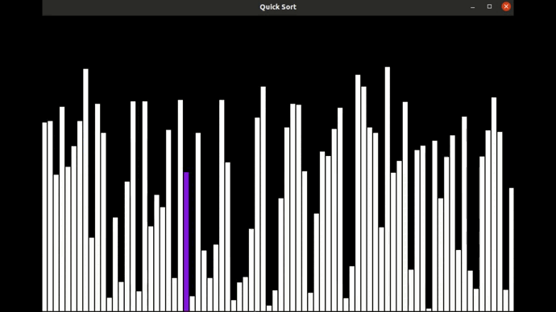
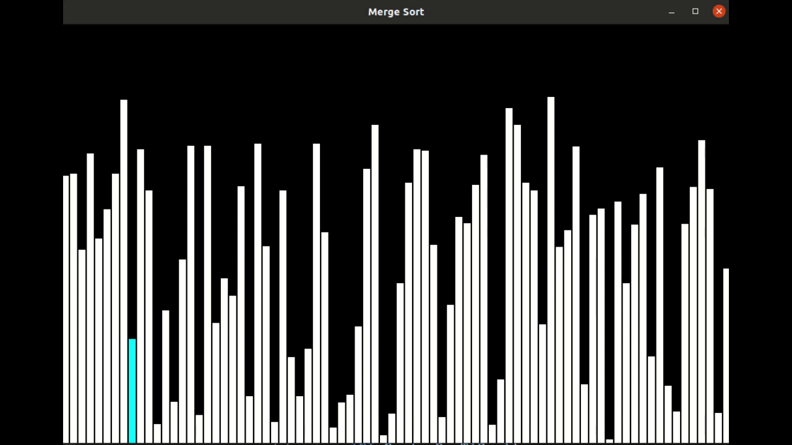

### **Project Name:**
# Sorting Algorithm Visualizer

#### About Project:

- Sorting is the process of arranging a collection of elements in numerical or lexicographical order, either ascending or descending.

- This is a Sorting Algorithm Visualizer implemented using the C programming language with a GUI.

- It helps in visualizing how different sorting algorithms work and also gives an idea of how fast they are.

- Sorts included in this project are:
  1. Bubble Sort
  2. Selection Sort
  3. Insertion Sort
  4. Quick Sort
  5. Merge Sort
  6. Radix Sort

#### How to run the code? (For Windows)

- **Install Visual Studio:**
  - Download and install [Visual Studio](https://visualstudio.microsoft.com/downloads/).
  - During installation, select the **"Desktop development with C++"** workload to install the necessary tools for compiling C programs.

- **Install CSFML Library:**
  - Download the CSFML package for Windows from [here](https://www.sfml-dev.org/download/csfml/).
  - Extract the CSFML files to a directory.

- **Set Up the Project in Visual Studio:**
  - Open Visual Studio and create a new **Console Application** project.
  - Add your source code (filename.c) to the project.

- **Linking CSFML in Visual Studio:**
  1. In Visual Studio, go to **Project** > **Properties**.
  2. Under **VC++ Directories**, add the path to the **include** folder of CSFML in **Include Directories**.
  3. Under **VC++ Directories**, add the path to the **lib** folder of CSFML in **Library Directories**.
  4. Under **Linker** > **Input**, add the following libraries to **Additional Dependencies**:
     - `csfml-graphics.lib`
     - `csfml-window.lib`
     - `csfml-system.lib`

- **Compile and Run:**
  - Build your project by selecting **Build** > **Build Solution**.
  - After building, the executable file will be generated in the **Debug** or **Release** folder.
  - Run the executable file by pressing **Ctrl + F5** in Visual Studio or navigate to the generated executable and run it manually.

#### Technologies Used:

- C  
- CSFML

#### How it works?

- The colored line in the white bars shows which element the sorting algorithm is operating on and how the element is getting sorted.
- After performing sorting logically according to the respective algorithms, it moves to the next element.
- Once the array is sorted, all the bars light up with different colors.

#### Working Application

##### Bubble Sort:

##### Insertion Sort:

##### Selection Sort:

##### Quick Sort:

##### Merge Sort:

#### **Pull Requests are Welcomed, Giving a Star is appreciated**
